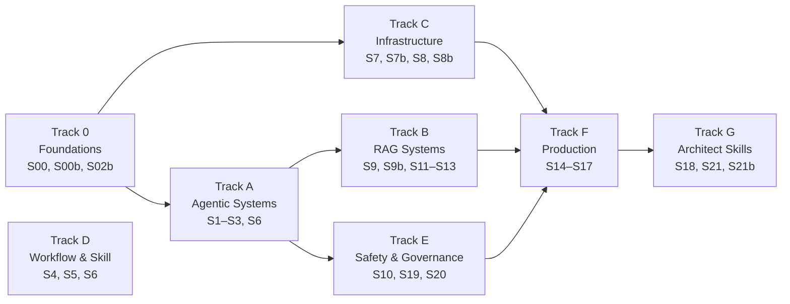
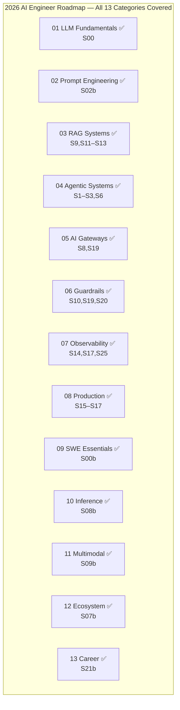

# the-agent-lab

> 46-session hands-on curriculum. LLM internals → agentic systems → production. Built with Claude, OpenAI, Ollama, LangGraph, and FastAPI. Run the labs, ship the code.

A structured, runnable curriculum for engineers who want to build real agentic AI systems — not just call an API. Covers the full 2026 AI engineer stack: LLM internals, prompt engineering, RAG, tool-using agents, multi-agent coordination, guardrails, observability, and production deployment. Every session ships working code.

[](LICENSE)
[](https://www.python.org/downloads/)
[](tests/)

---

## Where to start

| Goal | Go to |
|---|---|
| **See the code** | [`labs/`](labs/) — 21+ runnable Python examples |
| **Read the lessons** | [`labs/lessons/`](labs/lessons/) — per-topic walkthroughs with FAQ |
| **Conceptual deep dives** | [`labs/LEARNINGS.md`](labs/LEARNINGS.md) |
| **Full 46-session learning plan** | [`labs/CURRICULUM.md`](labs/CURRICULUM.md) + [`labs/CURRICULUM.csv`](labs/CURRICULUM.csv) |
| **Run something** | [Quick start](#quick-start) below |
| **Run the tests** | [Testing](#testing) below |

---

## What's in `labs/`

Each file teaches one concept and runs standalone. Files are prefixed with their session number.

### Track 0 — Foundations

| File | Concept |
|---|---|
| `00_llm_fundamentals.py` | LLM internals — tokenization, context windows, sampling, benchmarks, SDLC→agentic bridge |
| `00b_engineering_foundations.py` | FastAPI + pgvector skeleton — the engineering on-ramp for non-backend engineers |
| `02b_prompt_engineering.py` | Prompt workbench — zero-shot → few-shot → CoT → XML → extended thinking, cost/quality comparison |

### Track A — Agentic Systems

| File | Concept |
|---|---|
| `01_model_wrapper.py` | Model wrapper — `ChatAnthropic.invoke()` |
| `02_lcel_chain.py` | LCEL composition — `prompt \| model \| parser` |
| `03_agent_manual.py` | Manual tool-calling loop + parallel dispatch via `asyncio.gather` |
| `03_agent_framework.py` | Framework agent — `create_react_agent` from LangGraph |
| `12_mcp_server.py` + `12_mcp_client.py` | MCP — tools shared via JSON-RPC stdio |
| `12b_a2a_*.py` | A2A protocol — agent-to-agent task delegation |
| `13_reflection_agent.py` | Reflection — writer + critic loop with iteration budget |
| `13_plan_execute_agent.py` | Plan-and-Execute — planner + executor + aggregator |
| `14_multi_agent.py` | Supervisor + specialists pattern |
| `14_long_term_memory.py` | Vector-stored user facts across sessions |

### Track B — RAG Systems

| File | Concept |
|---|---|
| `09_rag.py` | Full RAG pipeline — load → split → embed → store → retrieve → generate |
| `09b_voice_image_agents.py` | Multimodal pipeline — STT → Claude → DALL-E/Flux → TTS (budget + quality tracks) |
| `22_hybrid_rag.py` | Hybrid RAG — dense + sparse (BM25) + RRF fusion + HyDE retrieval |
| `23_graph_rag.py` | GraphRAG — entity extraction + graph traversal |
| `24_corrective_rag.py` | Corrective RAG (CRAG) — relevance grading + web fallback |

### Track C — Infrastructure & Routing

| File | Concept |
|---|---|
| `07b_ecosystem_fluency.py` | HuggingFace Hub, open-weight models, provider shootout, benchmark reading |
| `08b_inference_platforms.py` | Cloud inference (groq/together/Fireworks) vs self-hosting (Ollama) via LiteLLM |
| `18_direct_anthropic.py` | Anthropic SDK direct — raw `messages.create`, streaming, tool use |
| `19_ai_gateway.py` | AI Gateway — LiteLLM routing, fallbacks, portkey, Kong |

### Track D — Workflow & Skill

| File | Concept |
|---|---|
| `04_prompt_caching.py` | Prompt caching — 76% cheaper per run with one keyword |
| `05_structured_output.py` | Typed output — `model.with_structured_output(PydanticModel)` |
| `06_parallel_chains.py` | LCEL fan-out — `RunnableParallel` |
| `07_output_parsers.py` | Six built-in output parsers + a custom one |
| `15_spec_driven.py` | Spec-Driven Development — Spec → Tasks → Code → VerificationReport |
| `16_vibe_coding.py` | Vibe Coding — generate → execute → reflect → retry |
| `17_claude_skills_router.py` | Claude Skills — modular knowledge bundles with description-based triggering |

### Track E — Safety & Governance

| File | Concept |
|---|---|
| `10_guardrails.py` | Input/output guardrails + guardrails-ai + NeMo Guardrails colang config |
| `31_red_teaming.py` | Red-teaming — prompt injection, jailbreak probes, adversarial eval |
| `32_governance.py` | AI governance — audit trail, policy enforcement, compliance checks |

### Track F — Production

| File | Concept |
|---|---|
| `08_chatbot_memory.py` | Stateful agent — `MemorySaver` + `thread_id` |
| `11_production_chatbot.py` | **Capstone** — RAG + memory + caching + guardrails composed |
| `25_evaluation.py` | Evaluation — Ragas + LangSmith + Langfuse tracing |
| `26_cost_optimization.py` | Cost optimization — caching, batching, model tiering |
| `27_streaming.py` | Streaming — SSE, WebSockets, token-by-token output |
| `28_production_app.py` | Production deployment — Docker, health checks, observability |
| `29_memory_architectures.py` | Memory architectures — short-term, long-term, episodic, semantic |

### Track G — Architect Skills

| File | Concept |
|---|---|
| `20_pdf_vision.py` + `20_citations_demo.py` | Files API, PDF vision, citations |
| `21_custom_graph.py` + `21_time_travel.py` | Custom LangGraph — branching, time travel, checkpoints |
| `21b_portfolio_generator.py` | Portfolio generator — AST-scans labs, writes PORTFOLIO.md + LinkedIn post via Claude |
| `30_system_design_helper.py` | System design — agentic architecture patterns for interviews |
| `33_ux_audit_helper.py` | AI UX patterns — progressive disclosure, confidence display, human-in-loop |

### Track M — Claude Code Mastery *(optional)*

| File | Concept |
|---|---|
| `41_repo_map.py` + `41_architecture_summary.py` | Codebase archaeology — map and summarize a repo with Claude |
| `42_browser_agent.py` + `42_computer_use_demo.py` | Browser automation + computer use API |
| `43_cron_agent.py` + `43_scheduled_routine.py` | Scheduled agentic routines |
| `44_doc_writer.py` + `44_slide_builder.py` + `44_resume_tailor.py` | Document generation agents |
| `45_review_orchestrator.py` + `45_reviewer_*.py` | Multi-agent code review — orchestrator + 4 specialist reviewers |
| `46_claude_code_project_structure.py` | CLAUDE.md, hooks, settings — Claude Code project setup |

### Capstone Projects

| Directory | Project |
|---|---|
| `labs/agritech/` | AgriTech engine — farm planning + crop diagnostics with knowledge base |
| `labs/coding_agent/` | Standalone tool-using coding agent |

---

**Reference files:**
- [`labs/CURRICULUM.csv`](labs/CURRICULUM.csv) — full 46-session tracker
- [`labs/lessons/`](labs/lessons/) — per-session lesson walkthroughs with Mermaid diagrams
- [`labs/lessons/roadmap-2026-mapping.md`](labs/lessons/roadmap-2026-mapping.md) — how every session maps to the 2026 AI Engineer roadmap

---

## The curriculum at a glance

**46 sessions across 13 tracks, ~92 hours, ~14 weeks** at 9 hours/week.

| Phase | Sessions | Tracks |
|---|---|---|
| **Foundation** | 1-17 | Agentic Patterns • Workflow & Skill • Alt Architectures • Data/Multi-modal • Graph Depth • RAG Architectures • Production |
| **Architect Skills** | 18-21 | System Design Interview • Red-teaming • Governance & Audit • AI Product UX |
| **Vertical Deep Dives** | 22-37 | Healthcare • Agriculture • Finance • Vidya Karana (wellness/yoga/Vedic) • Family AI Agent |
| **Claude Code Mastery** *(optional)* | 38-40 | CLAUDE.md best practices • Hooks • Autonomous workflows |

See [`labs/CURRICULUM.md`](labs/CURRICULUM.md) for the full session-by-session plan.





---

## Quick start

```bash
git clone https://github.com/SreeGD/the-agent-lab.git
cd the-agent-lab/labs

# Create a Python 3.10+ venv (3.11+ recommended for the mcp SDK)
python3.11 -m venv .venv
source .venv/bin/activate

# Install dependencies (first run pulls torch via sentence-transformers; ~5 min)
pip install -r requirements.txt

# Add your Anthropic API key
cp .env.example .env
# edit .env and set ANTHROPIC_API_KEY=sk-ant-...

# Run any example
python 01_model_wrapper.py            # one prompt
python 02_lcel_chain.py               # LCEL chain
python 03_agent_framework.py          # framework agent
python 09_rag.py                      # full RAG pipeline
python 11_production_chatbot.py       # the capstone
python 12_mcp_client.py               # MCP demo
python 15_spec_driven.py              # spec-driven dev
python 16_vibe_coding.py              # vibe coding
python 17_claude_skills_router.py     # skills triggering
```

Get an Anthropic API key at https://console.anthropic.com.

---

## Testing

A pytest test suite covers the deterministic parts of each session (PII regex, prompt-injection patterns, Pydantic schemas, sandbox helpers, skill frontmatter parsing, curriculum integrity).

```bash
cd labs
source .venv/bin/activate
python -m pytest          # → 30 passed
```

Real-LLM integration tests are marked `@pytest.mark.integration` and skipped by default. Run them with `pytest -m integration` (requires `ANTHROPIC_API_KEY`).

---

## Tech stack

- **Models:** Anthropic Claude (Sonnet 4.6, Opus 4.8), OpenAI GPT-4o, local Ollama (Llama, Mistral, Qwen)
- **Framework:** LangChain (LCEL), LangGraph (agents, state machines)
- **API layer:** FastAPI + Pydantic v2
- **Inference:** LiteLLM (multi-provider), groq, together.ai, Fireworks, Replicate
- **Embeddings:** `sentence-transformers/all-MiniLM-L6-v2` (local, free)
- **Vector store:** `InMemoryVectorStore` (swap for FAISS / Chroma / pgvector in production)
- **Tool protocol:** MCP (Model Context Protocol)
- **Skills:** Claude Skills (`SKILL.md` with YAML frontmatter)
- **Testing:** pytest with structural + unit coverage
- **Python:** 3.9+

See [`labs/requirements.txt`](labs/requirements.txt) for the full dependency list.

---

## Key mental models

The seven one-liners that compress the curriculum:

1. **The LLM never calls anything. The LLM Client does.** *(Tool calling, MCP, agents — all variations of one dance.)*
2. **A prompt is the input. A prompt template is a recipe for building a prompt.**
3. **An output parser adapts text (what the LLM emits) into typed values (what your code wants).**
4. **`prompt | model | parser` is sequential. `{"a": chain_a, "b": chain_b}` is parallel.**
5. **Each turn carries the whole conversation. Memory adds state. Caching keeps cost bounded.**
6. **The cache discount is real because the server skips prefill — the most expensive 80% of inference — not because Anthropic is being nice.**
7. **RAG = "I pick the right text client-side, the LLM reads only that text."**

Full discussion in [`labs/LEARNINGS.md`](labs/LEARNINGS.md).

---

## Status

**Active learning project.** All 46 sessions are built and cover every category of the [AI Engineer 2026 roadmap](labs/lessons/roadmap-2026-mapping.md): LLM fundamentals, prompt engineering, RAG, agentic systems, multi-agent coordination, guardrails, observability, production deployment, inference platforms, multimodal, ecosystem fluency, and career compounding. 30 passing tests, ruff clean.

This repo is built and maintained by **Sree** ([@SreeGD](https://github.com/SreeGD)) — a data scientist building toward full-stack AI engineering, one session at a time.

---

## Contributing

Issues and PRs welcome. Two principles to keep the codebase coherent:
- **Each file teaches one concept.** Don't combine unrelated patterns in one example.
- **Tests for deterministic logic.** LLM-dependent code is best-effort; regex/sandbox/Pydantic logic must have tests.

---

## License

[MIT](LICENSE) — use freely, attribute kindly.
