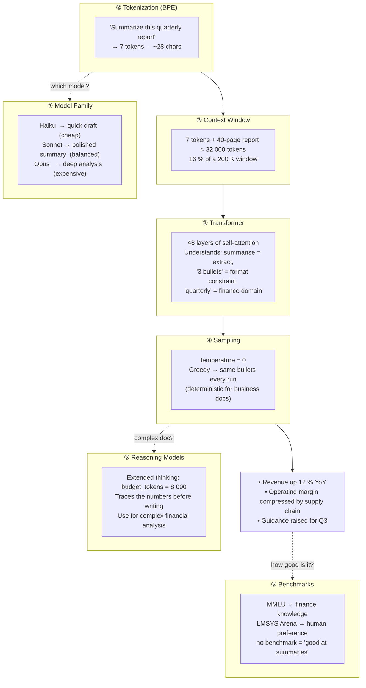

# Session 00 — LLM Internals & Model Selection

## Roadmap — You Are Here

```
[00] LLM Fundamentals  <-- YOU ARE HERE
       |
       v
[01] Model Wrapper & LangChain
       |
[02] LCEL Chain Composition
       |
[03] Agent Tool Loop
       ...
```

Session 00 is the prerequisite for every other session. It builds the mental model
you need to make smart decisions about models, context budgets, and sampling.

---

## Files Involved

| File | Purpose |
|---|---|
| `labs/00_llm_fundamentals.py` | Runnable lab: tokenizer visualizer, fill %, temperature sampler, benchmark table |
| `labs/lessons/00-llm-fundamentals.md` | This document |

---

## Coming from Traditional SDLC?

If you've shipped REST APIs, microservices, or data pipelines, you already know more than you think. Here's the full concept map:

| Traditional SDLC | LLM / Agentic Equivalent | Key Difference |
|---|---|---|
| `POST /classify` endpoint | `client.messages.create()` | Response is probabilistic, not deterministic |
| JSON schema validation | `model.with_structured_output(PydanticModel)` | LLM fills the schema from natural language |
| `application.properties` / config | System prompt | Behavior is specified in prose, not key-value pairs |
| Unit test fixtures (input → expected output) | Few-shot examples in the prompt | You're showing the model what "right" looks like |
| `if/else` routing logic | Supervisor agent routing | The LLM reads context and decides the branch |
| `try/except` error handling | Guardrails (input/output validation) | Catch semantic violations, not just exceptions |
| `SELECT ... FROM ... WHERE` | RAG retrieval (semantic search) | Matches by meaning, not exact string |
| Debug logging / `console.log` | Chain-of-thought / extended thinking | Makes the model's reasoning visible |
| Redis cache layer | Prompt cache | Saves the expensive "prefill" step on repeated context |
| Microservice | Agent | Can plan its own multi-step execution path |
| Event bus / Kafka topic | Multi-agent message passing | Agents produce/consume structured messages |
| Strategy pattern / function dispatch | Tool calling | LLM picks which function to invoke based on context |
| CI/CD pipeline | LangGraph state machine | Nodes = steps, edges = conditions, state = shared context |
| Rate limiter | `max_tokens` budget | Caps cost/latency per call |
| Integration test | LLM eval (Ragas, custom judge) | Tests semantic correctness, not exact string match |
| Schema migration | Prompt versioning | A prompt change = a deploy; version-control your prompts |

---

### The Three Mental Shifts

**1. Deterministic → Probabilistic**

Traditional function:
```python
def classify(text: str) -> str:
    if "great" in text or "love" in text:
        return "positive"
    return "negative"
```

LLM equivalent:
```python
def classify(text: str, client) -> str:
    response = client.messages.create(
        model="claude-haiku-4-5",
        max_tokens=10,
        temperature=0,
        messages=[{"role": "user", "content": f"Classify as positive/negative: {text}"}]
    )
    return response.content[0].text.strip().lower()
```

Same call, same input — may give slightly different output across model versions or without `temperature=0`. **Design for variance. Use evals, not assertions.**

---

**2. Syntactic → Semantic**

Traditional code processes exact strings. An LLM understands meaning.

```
Traditional DB query:  WHERE review_text LIKE '%great%'
RAG query:             similarity_search("customer loved the product")
```

The RAG query matches *meaning*, not keywords. "Fantastic experience", "10/10 would buy again", and "This exceeded my expectations" all retrieve as similar — even if none contain the word "great".

---

**3. Code Logic → Natural Language Instructions**

Traditional: you encode logic in Python.
Agentic: you encode intent in prose, and the model handles the logic.

```
Traditional:  if len(entities) > 1 and entities[0]["type"] == "ORG": ...
Agentic:      "Extract the primary organization mentioned. If none, return null."
```

The agentic version handles edge cases, ambiguity, and linguistic variation that traditional regex/parse code misses — but it's harder to unit-test. **This is the trade-off you're signing up for.**

---

### What Stays the Same

- **Interfaces still matter.** Define input/output contracts with Pydantic, exactly like you would for a REST API.
- **State must be explicit.** LLMs have no memory between calls. Pass conversation history or use a memory store — same as stateless HTTP services.
- **Observability is non-negotiable.** Log your prompts, responses, token counts, and latencies. LangSmith / Langfuse = your APM for LLM calls.
- **Fail fast at boundaries.** Validate LLM output before using it downstream, exactly like you'd validate external API responses.
- **Version your prompts.** A prompt change is a code change. Review it, test it, deploy it intentionally.

---

## The 7 Building Blocks

Every LLM call — from a two-word query to a 50-page document analysis — flows through the same seven mechanisms. They are not independent; each one feeds the next. The diagram below shows how they interlock. The worked example beneath it traces a single real prompt through all seven so you see them as a system before zooming into each.



---

### Worked Example — One Prompt, All Seven Blocks

**Prompt:** *"Summarize this quarterly report in 3 bullet points."* (plus a 40-page PDF)

| Block | What happens | Why it matters |
|---|---|---|
| **① Transformer** | 48 attention layers read every token simultaneously — understanding that "summarize" = extract, "3 bullets" = format, "quarterly" = business domain | Depth gives reasoning; width gives capacity. More layers = better nuance. |
| **② Tokenization** | "Summarize this quarterly report in 3 bullet points" → 11 tokens. The 40-page PDF → ~32 000 tokens. Code or tables cost 2–3× more tokens per character than prose. | Token count = API cost + latency. Knowing this lets you budget intelligently. |
| **③ Context Window** | 32 011 tokens total fits inside a 200 K window (16%). The model can attend to the entire report in one call — no chunking needed. | If you exceed the window, you need RAG. Knowing the fill % tells you which path to take. |
| **④ Sampling** | `temperature=0` → greedy decoding → same three bullets on every run. No randomness needed for business document extraction. | Wrong temperature = unpredictable outputs. Use 0 for extraction, 0.7+ for creative tasks. |
| **⑤ Reasoning Models** | Optional: `budget_tokens=8000` lets the model trace revenue figures before writing. Costs more but catches errors a single pass misses. | Use for high-stakes analysis. Skip for simple summaries — it's slower and pricier. |
| **⑥ Benchmarks** | MMLU measures whether the model knows finance; LMSYS Arena measures whether humans prefer its summaries. No single score = "good at your task." | Always run your own eval on your own data before committing to a model. |
| **⑦ Model Family** | Haiku: fast draft at low cost. Sonnet: polished, production-ready. Opus: deep analysis, cross-referencing figures. Start with Sonnet; escalate only if Sonnet fails your eval. | Over-engineering to Opus costs 10× more. Under-engineering to Haiku misses nuance. |

---

### 1. Transformers

A transformer predicts the next token by attending to all prior tokens simultaneously.
The core operation is self-attention.

```
Input tokens:  [T1]  [T2]  [T3]  [T4]
                |      |     |     |
               Embed  Embed Embed Embed
                 \      |     |    /
                  +--Attention layer--+   <-- each token sees all others
                  |                  |
               Residual stream (adds up across layers)
                  |
              [Logits] -- softmax --> P(next token)
```

Key insight: each layer adds a delta to the residual stream. Depth = more reasoning.
Width = more capacity per token. Both scale log-linearly with capability.

---

### 2. Tokenization (BPE)

Tokens are sub-word units learned by Byte-Pair Encoding (BPE).
Starting from individual bytes, the most frequent adjacent pair is merged repeatedly.

```
Step 0:  h e l l o _ w o r l d
Step 1:  h e ll o _ w o r l d    (merge: l+l -> ll)
Step 2:  h e ll o _ w or l d     (merge: o+r -> or)
Step 3:  h e ll o _ wor l d      (merge: w+or -> wor)
Step 4:  h e ll o _ world        (merge: wor+l+d -> world)
Final:   [h] [e] [ll] [o] [_] [world]   = 6 tokens
```

Rule of thumb: 1 token ≈ 4 English characters ≈ 0.75 words.
Code is denser — a Python line can cost 3-5× more tokens than prose.

The lab function `visualize_tokens()` approximates boundaries at every 4 chars and
calls `count_tokens` to get the exact API count.

---

### 3. Context Window

The context window is the maximum number of tokens the model can attend to at once.
KV-cache memory grows quadratically with sequence length:

```
Seq length    KV memory (relative)
----------    --------------------
   1 000              1 x
   8 000             64 x
  32 000          1 024 x
 200 000         40 000 x
```

Practical limits:
- Longer contexts cost more per token (prefill compute).
- Retrieval/RAG is cheaper than stuffing the full corpus.
- `fill_percentage()` shows how much of the window your text consumes.

---

### 4. Sampling — Temperature & Top-p

After the model produces a probability distribution over the vocabulary,
sampling controls how you pick the next token.

```
Vocab logits (simplified, 4 tokens):
  "cat"  = 3.2
  "dog"  = 2.8
  "the"  = 1.0
  "xyz"  = 0.1

temp=0  (greedy):  always pick "cat"  (argmax)

temp=0.7:          softmax({3.2/0.7, 2.8/0.7, ...})
                   "cat" ~60%  "dog" ~35%  "the" ~4%  "xyz" ~1%

temp=1.5:          softmax({3.2/1.5, 2.8/1.5, ...})
                   "cat" ~38%  "dog" ~34%  "the" ~19%  "xyz" ~9%
```

Top-p (nucleus sampling) further clips the tail: keep only the tokens whose
cumulative probability reaches p (e.g., 0.9) and renormalize.

Use temperature=0 for deterministic tasks (extraction, classification).
Use temperature=0.7–1.0 for creative/diverse tasks.
Never use temperature on claude-opus-4-7/4-8 (deprecated in Opus 4.x).

---

### 5. Reasoning Models

Reasoning models (o1, Claude 3.7/3.5 with extended thinking) spend extra tokens
on an internal chain-of-thought before producing the visible answer.

```
User prompt
    |
    v
[Thinking budget: up to N tokens]
  <think>
    Step 1: ...
    Step 2: ...
    Self-correction: ...
  </think>
    |
    v
[Visible answer]  <- what the user sees
```

Trade-offs:
- Higher accuracy on multi-step math, code, and logic.
- Higher latency and cost (thinking tokens are billed).
- Not needed for simple retrieval or classification.

---

### 6. Benchmarks

| Benchmark | Measures | Limitation |
|---|---|---|
| MMLU | 57-subject multiple-choice (high school → grad) | Static; contamination risk |
| HumanEval | Python function synthesis from docstrings | Only Python; short functions |
| LMSYS Arena | Human preference ratings (blind A/B) | Subjective; prompt-distribution dependent |
| MTEB | Embedding quality across 56 retrieval/classification tasks | Embedding models only |

No single benchmark predicts production quality. Always run your own eval on task-specific data.

---

### 7. Model Family Map

```
                  HIGH CAPABILITY
                       ^
                       |
    claude-opus-4-8    |    gpt-4o
    gemini-1.5-pro     |    (frontier)
                       |
LOW COST <-------------+-------------> HIGH COST
                       |
    claude-haiku-4-5   |    claude-sonnet-4-6
    llama-3-8b         |    llama-3-70b
                       |
                  LOW CAPABILITY
```

Selection heuristic:
1. Start with Sonnet (balanced cost/capability).
2. Drop to Haiku if latency or cost is the bottleneck.
3. Escalate to Opus only when Sonnet fails your eval.
4. Use local (Ollama/llama) when data cannot leave your network.

---

## Run It

```bash
# From project root
python labs/00_llm_fundamentals.py
```

Expected output (4 sections):
1. Tokenization visualizer — pipe-delimited approximation + exact API count
2. Context window fill % for the sample sentence
3. Three responses to the same prompt at temps 0.0, 0.7, 1.2
4. Benchmark comparison table

---

## Walk-through

**Block 1 — Tokenization visualizer**
`visualize_tokens()` splits the input every 4 characters to mimic token boundaries,
then calls `client.messages.count_tokens()` for the ground-truth count from the API.
The visual is approximate; the count is exact.

**Block 2 — Context window fill**
`fill_percentage()` returns `input_tokens / max_tokens`. For a 13-word sentence and a
200 000-token window, the result is a tiny fraction — illustrating how large modern
context windows are in practice.

**Block 3 — Sampling temperatures**
`sample_temperatures()` calls `messages.create` three times. Temperature 0.0 omits the
parameter entirely (the API treats absent temperature as deterministic). Temperatures
0.7 and 1.2 are passed explicitly. You should see identical or near-identical output at
0.0 and more varied output at 1.2.

**Block 4 — Benchmark table**
`benchmark_table()` returns hardcoded rows — no API call. `print_benchmark_table()`
renders them in aligned columns. The data is illustrative; check official leaderboards
for current numbers.

---

## Try This

1. **Token density**: call `fill_percentage()` on a 500-line Python file vs. an
   equivalent 500-word essay. Which uses more tokens per character?

2. **Temperature ceiling**: modify `sample_temperatures()` to try temperatures
   [0.0, 0.5, 1.0, 1.5, 2.0] on a creative prompt. At what temperature does the
   output become incoherent?

3. **Model swap**: change the `MODEL` constant to `"claude-haiku-4-5"` and re-run.
   Compare token counts and response quality. Does Haiku produce different token
   counts for the same text?

---

## Related

- Session 01 — Model Wrapper & LangChain: `labs/lessons/01-model-wrapper.md`
- Session 02 — LCEL Chain Composition: `labs/lessons/02-lcel-composition.md`
- Anthropic token counting docs: https://docs.anthropic.com/en/docs/build-with-claude/token-counting
- LMSYS Chatbot Arena: https://chat.lmsys.org
- MMLU paper: https://arxiv.org/abs/2009.03300

---

## SDLC Engineer Checklist

Before you build your first agentic feature, confirm you understand:

- [ ] What a token is and roughly how many your prompts consume
- [ ] Why the same prompt can return different outputs (and how to control it)
- [ ] Why `temperature=0` is not the same as "always identical" across model updates
- [ ] The difference between context window and memory
- [ ] How RAG replaces a database lookup (not augments it)
- [ ] Why you validate LLM output with Pydantic, not `assert`
- [ ] What "eval" means in the LLM world (it's not `pytest`)

All seven are covered in the sessions that follow.
