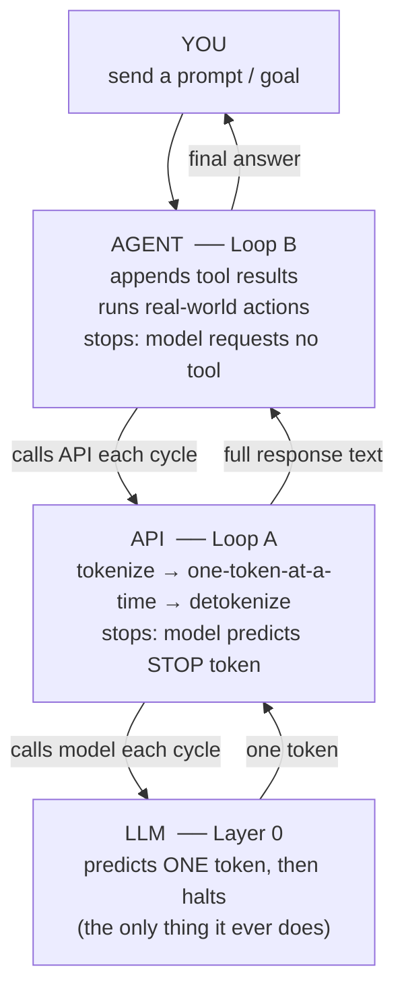

# Session 00c — From One Token to an Agent

> Companion to [Session 00 — LLM Fundamentals](00-llm-fundamentals.md).
> Read Session 00 first.

## The One Idea That Unifies Everything

The LLM is a pure function: tokens in → one token predicted → halt. It has no loop inside it, no memory between calls, no ability to restart itself. Everything below is about giving that engine eyes, hands, and the ability to take turns — via a single repeated pattern: **loop, and feed the output back in.**



---

## Loop A — How One Answer Is Built

The model can only predict one token, so to produce a full answer **an outer program runs it in a loop**, appending each token back into the input:

```
Run 1:  "Should I quit my job to farm?"                  → "It"
Run 2:  "Should I quit my job to farm? It"               → "depends"
Run 3:  "Should I quit my job to farm? It depends"       → "on"
Run 4:  "Should I quit my job to farm? It depends on"    → "your"
...      (hundreds of runs)
Run N:                                                   → [STOP]
```

Each run produces exactly **one** token. The answer you read is hundreds of single-token predictions chained together. Each token the model emits becomes part of the input for the next prediction — this is why coherent, multi-sentence answers emerge from a thing that only ever predicts one token.

**The API runs Loop A.** A raw API call is: text in → (tokenize → Loop A → detokenize) → text out.

---

## Chain of Thought — Content, Not a New Loop

When a model "thinks step by step," it is **not** entering a special mode. Chain of thought is simply **the content of Loop A when the early tokens are reasoning**:

```
"Let" → "me" → "think" → "." → "First" → "," → "the" → "income" →
... → "So" → "the" → "answer" → "is" → ... → [STOP]
```

Because each reasoning token conditions the next, the model "talks itself into" a better answer. Once it has generated "It depends on your finances and the type of farming," those words are now in its context, making the actual factors the high-probability next tokens.

> Chain of thought = Loop A producing reasoning tokens. Reasoning emerges from sequential prediction; it is not a separate faculty.

---

## Loop B — How a Task Gets Done

An **agent** wraps Loop A in a bigger loop that lets the model *act*. Each turn, the model may output a **tool request** instead of a final answer:

```
repeat:
    response = API call (Loop A runs internally → full chunk of text)
    if response requests a tool:
        result = run the tool (web search, code exec, file read, ask user)
        append result to context
    else:
        done  ← model gave a final answer
until no tool requested
```

A tool result is just **more tokens appended to the context**. The model's only native skill — reading and writing tokens — is enough, because a search result or a file is simply more text to read, and attention relates it to the original goal.

**Worked example** — *"Should I quit my well-paying job to go farming?"*

| Step | What happens |
|---|---|
| 1. Goal enters context | Raw LLM would emit generic pros/cons from frozen parameters |
| 2. Think | Highest-probability continuation: "this depends on facts I don't have" → decides to gather info |
| 3. Act | Outputs tool request (search realistic farm income) |
| 4. Observe | Results return as tokens; attention relates them to the goal |
| 5. Loop | Realizes decisive inputs (finances, motivation, family) can't be searched → asks the user |
| 6. Produce | Only now generates a grounded, tailored answer |

> The agent's strength isn't that it "knows" the answer — it's that it knows it *doesn't*, and has the tools and the loop to find out and ask.

---

## Division of Labor

| Job | Who does it |
|---|---|
| Predict one token (including STOP) | **LLM** |
| Append output and call the model again | **Outer program (API / agent)** |
| Run tools, take real-world actions | **Agent** |
| *Signal* when to stop (predict STOP / stop requesting tools) | **LLM** |
| *Enforce* stopping (honor STOP; cap max tokens / iterations) | **Outer program** |

**How stopping works:**
- **Loop A stops** when the model predicts the special STOP token. The program watches for it and halts.
- **Loop B stops** when the model returns a turn with no tool request.
- **Backstops:** `max_tokens` (Loop A) and `max_iterations` / timeouts / cost caps (Loop B) — pure software guardrails.

> The model doesn't "decide to stop" as a separate act — it *predicts* a stop signal, and the outer program *honors and enforces* it.

---

## The Same Pattern at Every Scale

| Level | Loop | What feeds back | Output |
|---|---|---|---|
| Token | Loop A | Each token appended | A full answer |
| Reasoning | Loop A (content) | Each reasoning token conditions the next | A reasoned answer |
| Task | Loop B | Each answer + tool result | A completed task |

> An agent is **not a smarter LLM** — it is the same LLM given tools (eyes and hands), loops run by the outer program (the ability to take turns), and a goal (a destination).

---

## Quick Self-Check

1. Why would a word-level vocabulary fail on a brand-new slang term, but a token-level one wouldn't?
2. If you double the number of tokens in a prompt, roughly how much more does attention cost — and why?
3. In "the trophy didn't fit in the suitcase because it was too big," what job does attention do?
4. What are Q, K, and V — what does each represent?
5. What's the difference between *context* memory and *parameter* memory?
6. During inference, do the parameters change? What about during training?
7. Where is the fact "Paris is the capital of France" stored inside the model?
8. Name two reasons the same prompt can produce different answers.
9. What is Loop A? What runs it?
10. What is Loop B? When does it stop?

---

## One-Page Cheat Sheet

| Term | Definition |
|---|---|
| **Token** | Subword chunk; the unit LLMs read and write |
| **Vocabulary** | The full fixed set of tokens (the model's alphabet) |
| **Sequence length** | Number of tokens processed at once; drives O(N²) cost |
| **Attention** | Every token weighs every other; Q/K/V framework |
| **Transformer** | Architecture from "Attention Is All You Need" (2017) |
| **Context window** | Short-term memory; temporary, this session (like RAM) |
| **Parameters** | Permanent learned knowledge; frozen weights (like a hard drive) |
| **Training** | Nudging knobs to reduce next-token error; happens once |
| **Inference** | Running frozen knobs forward to predict tokens; every message |
| **Knowledge storage** | Numerical positions + connection strengths; distributed, not stored as text |
| **Non-determinism** | Deterministic math + deliberate sampling + probabilistic knowledge + context |
| **Loop A** | The API's one-token-at-a-time loop; builds a full response |
| **Loop B** | The agent's call-act-observe loop; accomplishes a goal |
| **Chain of thought** | Loop A's content when early tokens are reasoning; not a separate loop |
| **STOP token** | Special vocabulary token the model predicts to signal it's done |

---

## Related

- [Session 00 — LLM Fundamentals](00-llm-fundamentals.md) — prerequisite
- [Session 03 — Agent Tool Loop](03-agent-tool-loop.md) — Loop B in running code
- [Session 13 — Reflection Agent](13-reflection-plan-execute.md) — chain-of-thought as an outer loop
- [Session 14 — Multi-agent](14-multi-agent-ltm.md) — Loop B with multiple specialized agents
